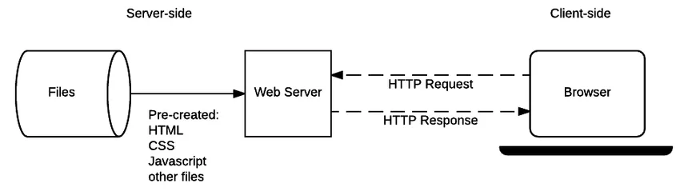
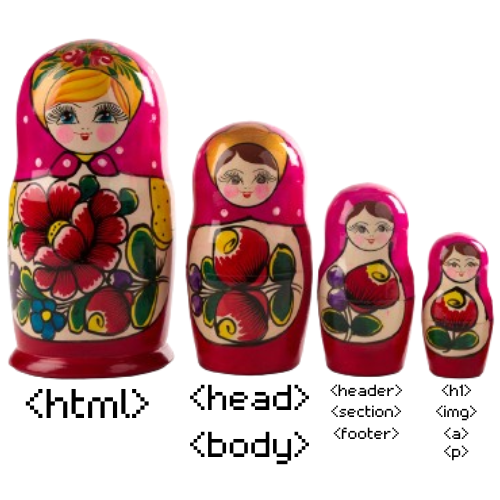

# Chapter 2: The basics

## 2.1 What is a website

Nowadays we all know what a website is. You probably browse them daily, via Google Chrome or any other browser.
Quoting the Wikipedia;

> A website (also written as a web site) is a collection of web pages and related content identified by a common domain name and published on at least one web server. Websites are typically dedicated to a particular topic or purpose, such as news, education, commerce, entertainment, or social media. Hyperlinking between web pages guides the navigation of the site, which often starts with a home page. 

And if you pack all together every website in the world, you get the World Wide Web(A.K.A internet)!
In case you don't know what the internet is, imagine the whole internet as a jar of cookies; The jar is the World Wide Web, the cookies are websites and each piece of chocolate is a web page.
What's even cooler is that websites can serve various purposes. From selling books to broadcasting the radio, every website is can do anything you want! Amazing, isn't it?

Websites connect to clients(Users) via HTTP requests. They're pretty straightforward and we won't cover them in our book since web browsers already handle that stuff for us.
Let me link a scheme down here to show you how the connections work.

You can see there is a connection between the *web server* and the *client*. A web server is a machine *serving*(Sending the files) files to the *client*. The *client* is the web browser the user uses to browse the web through via a terminal such as a PC or a phone.  

But you may be asking yourself, what's a web browser? A web browser is a piece of software that enables you to navigate through websites. It retrieves the HTML code from any Web Server and it displays the website on the client following a set of standards that all browsers share.

Now that we know what the internet, websites, and web browsers are, let's dive further into how they work.

## 2.2 Skeleton of a web page

Websites are made from HTML tags. The tags are composed of a "less than"(<) symbol, the name of the tag, its attributes, and a "greater than"(>) symbol.
Some tags are 
- The `<html>` tag, which contains the body and the head of an HTML document.
- the `<h1>` tag, which displays a heading.
- The `
` tag, which displays a paragraph.
- The `<a>` tag, which displays a link.

All of these tags are inside other tags, and they can be displayed like a Matrioska.

\newpage
