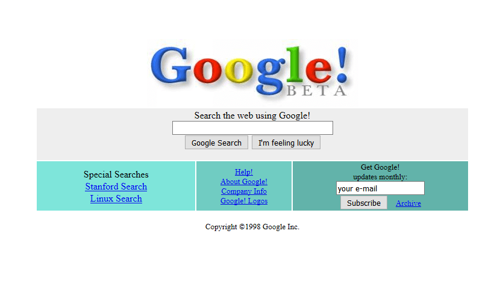

\pagebreak
# Prologue (By WoepdieCat)
Poyo is the best peep in the world

# Brief history of web development in the early 1990s-2000s
Back in the day, we didn't have all the fancy tools and resources we do now. Webmasters —the folks who built and managed websites— hand-coded everything, paying close attention to every detail. While design was a thing in the early 90s, it wasn't the "web design" we think of today. People made their websites not to look professional, but to be as unique as possible. 

There were many trends, such as having your visitors sign a guestbook, visitor counters and stamp/blinkies/buttons(More on that later), and believe it or not, Comic Sans was all the rage worldwide.
Yep O-O, Comic Sans. What the fu~ \newpage

In the 90s, the search engines were bad. So people interconnected their websites by entering on Webrings and Sharing Buttons with their friends.  