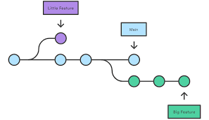

# Tools and Setup

Since we'll be editing files in this book, we'll need to use a code editor. You can use whatever code editor you want, but because VScode is the most popular editor out there, we'll be using. We'll also need to use a version control tool, Git, to manage many versions of our code.

In this chapter, we will explore the powerful combination of Visual Studio Code (VScode) and various web development tools that will be very useful! 

## 1.1.1 Getting Started with VScode

VScode is a popular code editor developed by Microsoft. It provides a wide range of features and extensions that make it a favorite among many web developers. To get started with VScode\footnote{Official video-guide: https://www.youtube.com/watch?v=B-s71n0dHUk}, it's as simple as visiting their official website\footnote{You can get VScode from https://code.visualstudio.com/.} and downloading VScode. Afterward, make sure to run the installation wizard and you're now good to go!

## 1.1.2 Essential Extensions for Web Development in VScode

VScode by itself is good, but it has most of the features developers want. That's why VScode offers a handy collection of extensions that enhance the web development experience. These add new features such as lintering, syntax highlighting and grammar correction. They can be installed from the *extensions* tab in the left sidebar. Here are some essential extensions to consider:

1. **HTML CSS Support**: Provides autocompletion and syntax highlighting for HTML and CSS.
2. **Live Server**: Launches a local development server and automatically refreshes the browser whenever you make changes to your HTML, CSS, or JavaScript files. I personally love this extension because it makes web development so easy, that I can finish websites in a matter of minutes.
3. **Prettier**: Prettier automatically formats your code to ensure consistent styling and readability.
4. **Rainbow Indent**: It helps a lot with indenting and if you indent correctly, it will display a rainbow! :) Cool, isn't it?
5. **Live Share**: This extension allows you to share your local machine with your peers, so you can work collaboratively in a single dev environment! You can edit one file while your peer edits another one. It's a must-have extension in my opinion.

## 1.1.3 Collaboration and Remote Development

You may also want to collaborate with your friends on the making of your website. For that purpose, VScode enables seamless collaboration and remote development. Here are some things to consider:

1. **Live Share(extension)**: With Live Share, you can share your development environment with others, allowing them to edit and debug code in real time.
2. **GitHub Codespaces(service)**: GitHub offers a service called Codespaces, which provides a cloud-based development environment with VSCode pre-installed. With Codespaces, you can access a Linux machine from anywhere in the world, making it convenient for remote development.

## 1.1.4 How to use VSCode?

It's quite simple to use VScode, here's a step-by-step tutorial about it!

1. **Opening a Project**: Once you have installed VSCode, open it and you will see the welcome screen. From there, you can either open an existing project or create a new one. To open an existing project, click on "Open Folder" and select the folder containing your project files.
2. **Editor Layout**: The VSCode interface consists of several components. The *editor groups* are the editor, where you write your code. On the left side, you have the *activity bar*, which provides access to different views like the file explorer, source control, extensions, and more. At the bottom, you have the *status bar*, which displays information about the current file, a handy terminal and it also provides quick access to various settings. 


3. **Terminal**: VScode has an integrated terminal to make coding easier. You can access it by opening the bottom bar. But be careful! It will be a live terminal running on your computer. I suggest doing all of your changes in a single folder and then, once you're finished, move all of the files inside to the location where you'll be running them.

## 1.2 Git 
### 1.2.1 What is Git?

{width=50%}

Git is a widely used version control system. It's useful for having and maintaining different versions of your code, and to store them in GitHub for free. 
Git works by branches. Textually from Git's docs:

> Branching means you diverge from the main line of development and continue to do work without messing with that main line.

What does that mean? In Git there is a *main* branch, and then you can create more branches to independently write code/features for your project without messing up the *main* branch, the current *working* code. And if you 
Once you finish coding, you can pull the branch to *main*
Thankfully, VScode offers excellent integration with Git, which means we won't have to ever use any Git commands while using VScode. However, it's really important to learn them, since they can help us a lot in many scenarios. Let's see how can we use it!

{width=50%}

## How to use git?
Git is a command line tool. That means it can be accessed and used via the terminal. The main Git commands\footnote{Full list of commands available at https://confluence.atlassian.com/bitbucketserver/basic-git-commands-776639767.html} are:

1. To authenticate yourself: 
```
git config --global user.name "<username>"
git config --global user.email <email>
```
2. To start developing:
   - `git init` - Create a new repository
   - `git clone <repository url>` - Download a copy of a repository to commit changes or just to use the code.
3. To save your work
    - `git add .` - Add all the files changed to the commit.
    - `git commit -m "<Commit message>"` - Commit changes to the head branch of your git repo(repository)
    - `git push` - Send the changes and store them in the GitHub repo

An example of me cloning my repository named "repository", changing one file, adding it to the commit, and pulling the commit to the repo.

```bash
git config --global user.name "poyo"
git config --global user.email poyo@example.com
git clone https://github.com/mrdapoyo/repository

*Edits file data.txt*

git add
git commit -m "Poy Poyo! Cleaned the code"
git push
```

In this chapter, we managed to get started with VScode, installed some essential extensions for web development, collaboration features and we learned about version control with Git. In the next chapter, we will learn about the basics of building websites. See you there!
\newpage